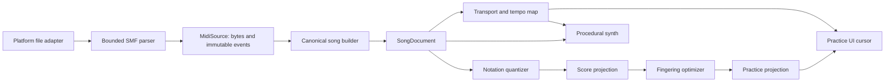

# Technical architecture

Status: planning baseline accepted; validate the stack in milestone M0

## Decision summary

Build a vertical technical spike in Godot 4.7 using typed GDScript and the Compatibility renderer. Keep the musical core free of scene/node dependencies and keep platform APIs behind adapters. Continue with Godot only if the spike passes the explicit gate below.

This is a measured choice rather than a claim that Godot is the easiest notation platform. Godot gives LibreTabs one codebase for a highly custom, responsive practice surface, procedural audio, headless logic tests, and web/desktop exports. Its weak points are browser file exchange, notation libraries, accessibility semantics, and MIDI synthesis. A conventional TypeScript/Tauri app has stronger ready-made notation and Web Audio libraries, so it remains the fallback if the spike shows we would be fighting the engine.

## M0 Godot decision gate

The Godot spike must demonstrate all of the following in one small web and Linux build:

1. A user gesture opens a browser `.mid` file and delivers its bytes to GDScript; desktop uses a native file dialog through the same adapter interface.
2. A format-0 and a format-1 fixture parse into the same documented canonical model in headless tests.
3. A Bravura/SMuFL smoke score renders a clef, meter, notes, rest, accidental, beam, tie, ledger line, and aligned six-line tab at narrow and wide sizes.
4. A single `AudioStreamGenerator` mixes at least 32 procedural voices, tempo changes, a metronome, seek, and a short loop without stuck notes.
5. A cursor driven from the transport remains within 30 ms of scheduled note onsets over ten minutes in the managed VM's current Chromium; record the exact browser version with the result.
6. The PWA-enabled web export initializes without console errors through the managed HTTPS host, reloads with the network disabled after one successful load, and presents an actionable fallback if its cache is unavailable. The Linux export runs locally.
7. Pseudolocalized labels at 200% UI scale remain operable; keyboard focus is visible.
8. The team records what screen readers can and cannot access in the resulting canvas app.

If audio/timing or file upload fails but has a small isolated adapter fix, continue. If useful accessibility requires duplicating the whole UI, basic notation requires a near-full engraving engine, or portable audio requires platform-specific native extensions, prototype the same slice in TypeScript/Tauri before choosing.

## System shape



The key rule is that `SongDocument` and `Transport` are shared authorities. Rendering and tablature never reinterpret wall-clock time independently, and arrangement never mutates import data.

## Planned source layout

```text
project.godot
export_presets.cfg
assets/
  fonts/                  # Versioned font plus its separate license
content/
  lessons/                # Data-driven lesson manifests and original exercises
src/
  app/                    # Navigation and composition root
  core/
    midi/                 # Byte reader, SMF parser, validation, normalization
    music/                # Value objects, tempo map, measures, pitch spelling
    arrangement/          # Quantization, clef selection, fingering, diagnostics
    transport/            # State machine and injectable clock
  audio/                  # Voice definitions, scheduler, mixer, metronome
  notation/               # Geometry/layout and SMuFL drawing
  platform/               # Desktop/web file and persistence adapters
  ui/                     # Scenes, presenters, themes, reusable controls
  learning/               # Lesson state and local progress
tests/
  fixtures/midi/          # Generated or clearly licensed minimal fixtures
  unit/
  integration/
third_party/
  README.md               # Source, pinned version, license, modifications
```

Prefer composition and plain `RefCounted` value/service classes over deep node inheritance. Nodes own lifecycle and draw/audio integration; core services own musical rules.

## Canonical data contracts

Exact GDScript resources/classes will be fixed during M0. Semantically, use these types:

```text
MidiSource
  original_bytes: PackedByteArray
  format: int
  division: TicksPerQuarter
  tracks: [SourceTrack]
  events: [SourceEvent]
  metadata: SourceMetadata

SourceEvent
  id, track_index, ordinal
  byte_offset, byte_length
  absolute_tick, resolved_status, kind
  raw_payload: PackedByteArray

SongDocument
  source: MidiSource
  division: TicksPerQuarter
  tempo_map: [TempoChange]
  meter_map: [TimeSignature]
  key_map: [KeySignature]
  tracks: [SongTrack]
  end_tick: int
  diagnostics: [Diagnostic]

SongTrack
  id, source_index, name
  channels, programs
  notes: [TimedNote]
  controller_events: [TimedController]
  is_percussion: bool
  analysis: TrackAnalysis

TimedNote
  id, track_id, channel, pitch, velocity
  start_tick, end_tick
  source_event_ids: [SourceEventId]

ScoreProjection
  source_track_id
  settings: ProjectionSettings
  measures: [NotatedMeasure]
  source_note_links: Dictionary[NoteId, Array[NotatedEventId]]
  diagnostics: [Diagnostic]

PracticeProjection
  score: ScoreProjection
  tuning: Tuning
  placements: Dictionary[NoteId, FretPlacement]
  difficulty: DifficultySummary
  diagnostics: [Diagnostic]
```

Use integer ticks and rational musical durations until the audio scheduling boundary. Do not accumulate beats using floating-point frame deltas. Convert ticks to seconds through a precomputed piecewise tempo map and convert seconds to audio frames at the final boundary.

All IDs are deterministic from source ordering, not generated UUIDs. This keeps test snapshots stable and lets diagnostics point back to imported events. One source note may become several tied notated events, so projection links are one-to-many.

`MidiSource` retains the exact imported byte sequence for the current session and an immutable ordered parse with source spans. Core APIs expose it read-only or return copies; normalization never edits it. Normalized notes, score events, and fret placements retain stable links back to their source events. This supports honest diagnostics and lets later projections be regenerated without pretending quantization changed the import. The original bytes are discarded when the session ends unless the learner explicitly saves the import.

## MIDI ingest

### Parser strategy

M0 compares three options against the same compliance fixtures:

- a narrow application-owned pure-GDScript SMF 0/1 parser;
- the MIT-licensed pure-GDScript MIDI reader from Clef, currently marked unstable by its publisher;
- the MIT `nlaha/godot-midi` parser, which currently relies on a GDExtension and publishes no web binary.

The provisional preference is the narrow owned parser because SMF parsing is bounded, byte-oriented work and web portability is non-negotiable. Reuse a library only if it passes malformed-input tests, keeps the core model independent, and materially reduces maintenance. Record the result and exact pinned revision before vendoring code.

### Defensive byte reader

All reads flow through a cursor that checks remaining bytes before every operation. It supports big-endian fixed integers and MIDI variable-length quantities with a four-byte limit. Chunk lengths are validated against remaining bytes and configured caps before allocation.

The parser produces structured errors containing a code, byte offset, track index if known, safe user message key, and technical detail for logs. It must not echo arbitrary imported text into logs without sanitizing/control-character removal.

Parsing stages are header, track chunks, delta-time accumulation, status/running-status resolution, channel/meta/system event decoding, and end-of-track validation. Normalization pairs notes and extracts tempo/meter/key/program metadata without discarding source events.

### Import analysis

For each pitched track, calculate:

- sounding note count and duration;
- minimum/maximum and percentile pitch range;
- peak polyphony;
- proportion in E-standard range through fret 20;
- proportion of chord slices with at most six unique pitches;
- rhythmic density and smallest observed inter-onset interval;
- program names and source track/channel names.

Recommendation is deterministic and explainable. Favor guitar-family programs, range coverage, lower polyphony, and meaningful note count. Never hide other tracks.

## Display quantization and staff notation

The display quantizer takes note starts/ends, meter map, and a user/detail policy. It does not change playback.

For MVP, generate candidates on a straight 1/16 grid, including coarser and dotted values. Choose the candidate set that minimizes a weighted cost for onset error, duration error, ties, rests/fragments, and very short notation values. Bound search per measure and fall back to a deterministic greedy projection with a warning if limits are exceeded.

Group near-simultaneous onsets into chord slices using a tolerance derived from the source division and quantization grid. Do not merge repeated pitches whose sounding intervals are distinct. Split durations at measure boundaries and use ties.

Pitch spelling uses the imported key when available. Without a key, choose a stable spelling that minimizes accidentals per measure, prefer sharps for sharp-key hints and flats for flat-key hints, and remember accidental state within a measure.

The score layout is deliberately narrow:

- one selected track;
- one rhythmic voice;
- staff and tab paired as a system, with tab visually primary and staff always present as reference;
- screen layout, not pagination/printing;
- common meters and binary subdivisions;
- measure geometry computed separately from drawing.

Use Bravura, the SMuFL reference font under SIL OFL 1.1, for musical glyphs. Draw staff/tab lines and ties as primitives. Pin the font version and include its license/metadata. The regular UI font needs broad-script coverage and will be selected when the first actual translation is chosen.

`ScoreLayoutEngine` outputs semantic draw items and bounding boxes. `ScoreCanvas` only paints them and applies current/selected state. This makes geometry unit-testable and enables future hit testing or another renderer.

## Guitar tablature optimizer

### Candidate generation

Given tuning pitches from low string to high string, pitch `p` can use a string with open pitch `o` when `0 <= p - o <= max_fret`; the fret is `p - o`. At a chord slice, enumerate injective assignments of unique pitches to strings. Reject more than six unique pitches, impossible ranges, and assignments beyond the configured physical span.

Deduplicate equivalent pitch/string/fret configurations and bound candidate count with deterministic ranking before sequence optimization.

### Sequence optimization

Treat each onset/chord slice as a layer in a directed acyclic graph. Nodes are playable configurations; edges carry transition cost. Dynamic programming chooses the minimum total path for a phrase/section.

Cost components are data, not scattered constants:

```text
node cost
  average/highest fret
  within-chord non-zero fret span
  number of awkward string gaps
  barre/stretch proxy
  optional open-string and beginner-position preference

transition cost
  hand-anchor movement
  change in occupied string set
  large single-finger travel proxy
  rapid position change weighted by available musical time
```

Segment at long rests and explicit phrase/measure boundaries to control memory, but include the preceding hand anchor as initial state for the next segment. Stable tie-breaking is mandatory.

Diagnostics distinguish source out of instrument range, too many simultaneous pitches, physically excessive span, optimizer budget exceeded, and supported-but-difficult. A later UI can expose alternate solutions because source-to-candidate links remain intact.

## Transport and procedural audio

### One transport

`Transport` is a state machine with stopped, count-in, playing, paused, seeking, and completed states. It owns source tick, loop tick range, speed multiplier, and track mute/solo state. It exposes position snapshots and seek/state events; it does not render or synthesize.

Tempo scaling changes tick-to-frame scheduling rather than resampling, so pitch stays fixed. Loop end is half-open. A seek or loop wrap sends all-notes-off, restores channel state applicable at the new tick, rebuilds the scheduling cursor, and pre-fills the buffer.

Tests inject a fake frame clock. Runtime uses rendered audio frames/AudioServer timing as the primary clock, not `_process(delta)` accumulation. The UI interpolates visual position from the latest transport snapshot and resynchronizes rather than integrating its own time.

### Playback backend boundary

Godot supports MIDI device input but not MIDI output or built-in Standard MIDI File synthesis. LibreTabs therefore turns MIDI events into sound internally.

Separate sequencing from sound generation. The application-owned `Transport` schedules normalized note and controller events because that same authority must drive notation, tablature, looping, and the cursor. A `SynthBackend` receives timestamped events and renders sound through its own bounded voice mechanism; it must not own song position or mutate the canonical document. This boundary permits a small built-in synth, an audited third-party implementation, or a later user-supplied SoundFont backend without rewriting practice behavior.

M0 compares two web-capable sound paths behind that interface:

1. an application-owned `AudioStreamGenerator` oscillator/envelope backend; and
2. the smallest usable runtime subset of the MIT-licensed Clef SoundFont/player code, with no editor or composition features and no bundled SoundFont.

The default plan is the bespoke backend because intelligible pitch, timing, and track distinction are sufficient for guided practice. It is also the fallback even if Clef is adopted as an enhanced backend. Adopt third-party playback code only if the pinned subset passes web export, deterministic seek/loop/all-notes-off behavior, performance, malformed-input, license/provenance, and maintenance tests. `godot-midi` is not an audio-backend candidate for the web-first MVP because its published GDExtension targets do not include web.

### Built-in practice synthesizer

Use one `AudioStreamGenerator` and an application mixer with a fixed voice pool. Begin with 32 voices in the spike and set the release target after profiling. Voice stealing is deterministic: released/quietest first, then oldest, while protecting the currently selected practice track where possible.

Use a small code-generated palette rather than bundling a SoundFont:

- plucked/decaying voice for guitar and other short-decay programs;
- triangle/sine voice with ADSR for keyboard and sustained programs;
- bass voice with limited harmonics;
- click/noise voices for a small General MIDI percussion subset and metronome.

Map all GM programs into these few families. This will not reproduce an original arrangement; label it **Practice synth**. Support note velocity, channel volume/expression, pan, program changes, sustain, and pitch bend only as they pass tests. Unknown controllers are retained in source data and safely ignored.

An optional SoundFont backend can follow MVP. SoundFont code and banks are separate licensing decisions: do not bundle a bank based only on a claim that it is free to download. If the M0 Clef experiment needs a bank, use a documented test-only asset that is not committed until its redistribution terms have been reviewed.

### Post-MVP volume impulse input

The first input experiment is deliberately not pitch recognition. An `ImpulseInput` adapter captures microphone or line-input samples, estimates a rolling noise floor/envelope, detects a debounced transient, and emits only `impulse(strength, monotonic_time)`. The step-practice controller may advance one cue; it never marks a note correct or computes a score.

The adapter must be optional, request permission only after an explicit action, process locally, retain no samples, expose input/sensitivity feedback, and have a keyboard/touch equivalent. Keep it separate from the playback mixer and canonical song model so denial, missing devices, browser differences, or false triggers cannot break ordinary guided playback. Treat echo cancellation, automatic gain control, line-input behavior, and background-tab suspension as platform test variables rather than assumed constants.

## Platform adapters

Define interfaces around capabilities rather than checking feature tags throughout UI code:

```text
FilePicker.pick_midi() -> FilePayload(name, bytes)
LocalStore.load/save(schema_version, data)
HostCapabilities(web, desktop, touch, midi_input, screen_reader_notes)
```

Desktop uses a native `FileDialog` where supported and `FileAccess`. Godot's web `FileDialog` cannot read the host filesystem, so web uses a small audited custom HTML/JavaScript picker and `JavaScriptBridge` to pass an `ArrayBuffer` as `PackedByteArray`. The JavaScript callback reference must be retained until completion. Drag/drop is optional for the first slice and uses the same payload path.

Web persistence uses `user://`/IndexedDB with explicit filesystem synchronization where needed. Desktop uses a custom user directory. Imported bytes are not persisted unless the learner opts in.

The web export enables Godot's progressive web app support. Release checks cover initial online load, service-worker installation, a network-disabled reload, cache updates between versions, and the explanatory fallback shown when browser storage has been cleared or evicted. Offline-after-first-load is a tested capability, not a promise that browsers will retain cached files forever.

The default web export should start without threads for deployment simplicity. Enable thread support or web GDExtension only if profiling proves it necessary; doing so requires cross-origin isolation and constrains third-party resources.

## Localization architecture

- UI calls `tr()`/`tr_n()` with stable full-sentence source messages and contexts.
- Lesson manifests refer to message keys and semantic media, not embedded English layout.
- Diagnostic codes are stable and map to localized summaries plus optional technical details.
- Note display policy is separate from locale: fixed-do/letter names, B/H conventions, and accidental glyphs are explicit settings added when needed, not inferred blindly.
- Numbers and percentages are formatted through one presentation service so locale-aware formatting can be added centrally.
- Translation templates and source `.po` files remain in version control.

## Privacy and security

- No network code in the MVP runtime. Web hosting naturally fetches the application bundle; practice data remains local.
- Bound all imported sizes/counts/durations and algorithm search budgets.
- Do not interpret MIDI text as markup, a file path, a URL, or executable code.
- Sanitize filename/metadata for UI and logs, and never use imported names to construct a write path.
- Persist only versioned JSON/ConfigFile data owned by the app. Handle corrupt state by backing it up or resetting the affected namespace, not by failing startup.
- Document that MIDI may itself be copyrighted and that users are responsible for files they import; do not ship scraped songs.

## Dependency and licensing policy

LibreTabs software, tests, build configuration, and application configuration are Apache-2.0. Project-authored documentation, lesson text, illustrations, original music, and MIDI fixtures are dedicated under CC0-1.0 so people can reuse them without an attribution requirement. Third-party works retain their own licenses and are never relicensed merely by inclusion.

Permissive dependencies can be included if their license and notices are preserved. File-level/copyleft libraries require a deliberate compatibility review. Every vendored dependency or binary asset gets a row in `third_party/README.md` and an in-app notices entry before merge. The path-level policy lives in `LICENSES/README.md`.

Expected early dependencies are Godot (MIT) and Bravura (SIL OFL 1.1). No MIDI library, UI framework, song corpus, general UI font, SoundFont, or test framework has been selected yet.

## Test architecture

### Unit

- byte cursor and every supported/unsupported MIDI event;
- tempo-map tick/second/frame conversion including boundaries;
- note pairing and malformed input;
- measure partition, quantization, pitch spelling, clef choice;
- candidate enumeration and optimizer path/cost/tie-breaking;
- transport state transitions and loop semantics;
- voice envelopes and deterministic voice stealing;
- local-state migration.

### Property/fuzz

- the parser never reads past a supplied byte array or hangs;
- output note intervals are ordered and non-negative;
- every fret placement reproduces the MIDI pitch and uses a unique string per chord;
- optimizer output is deterministic and never exceeds declared constraints;
- tick-to-seconds is monotonic across valid tempo maps.

### Integration

- import-to-practice snapshots for generated fixtures;
- exact source-byte preservation and stable event-link checks for every import fixture;
- audio event trace compared to expected note/program/controller sequence;
- seek/speed/loop leaves no active stale voices;
- narrow/wide/pseudolocale notation and controls;
- desktop and browser file-pick flows.

### End-to-end

- first lesson completion and persistence;
- import recommended track, arrange, mute the part, slow, and loop two measures;
- unsupported/malformed MIDI recovery;
- web canvas boot and console/network error check through managed HTTPS;
- first online load followed by a network-disabled reload, plus a cache-update test between two versioned builds.

## Observability without telemetry

Use structured local diagnostic logs with categories and bounded history. A **Copy diagnostic report** action may include version, platform capability flags, sanitized parser error codes, and performance counters, but never MIDI content, filenames, lesson history, or machine identifiers unless separately selected by the user.
