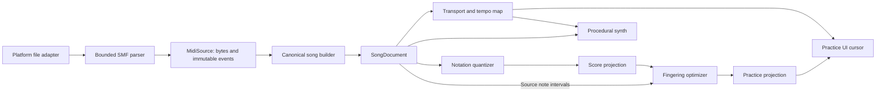

# Technical architecture

Status: Godot retained by owner decision 0005; M0 technical validation remains incomplete

## Decision summary

Continue with Godot 4.7, typed GDScript and the Compatibility renderer under [decision 0005](decisions/0005-godot-and-appearance.md). Keep the musical core free of scene/node dependencies and platform APIs behind adapters. The owner prioritizes platform support; screen-reader integration is deferred and no longer blocks this stack choice. The technical checks below still describe outstanding validation.

This owner-directed choice builds on the evaluated prototype; it does not claim Godot is the easiest notation platform. Godot gives LibreTabs one codebase for a highly custom, responsive practice surface, procedural audio, headless logic tests, and web/desktop exports. Its weak points are browser file exchange, notation libraries, accessibility semantics, and MIDI synthesis. A conventional TypeScript/Tauri app was the original comparison candidate. Decision 0005 retains Godot; no replacement spike is currently planned.

The prototype implements a deliberately smaller subset, documented in [decision 0002](decisions/0002-m0-evaluation-build.md). Its threaded web/audio-worker mitigation and conservative import limits apply to evaluation; the contracts below remain the intended production destination. See [measured evidence](evidence/m0-prototype.md).

## M0 technical validation

The Godot implementation retains these technical validation tasks; item 8 is deferred and non-blocking under decision 0005:

1. A user gesture opens a browser `.mid` file and delivers its bytes to GDScript; desktop uses a native file dialog through the same adapter interface.
2. A format-0 and a format-1 fixture parse into the same documented canonical model in headless tests.
3. A Bravura/SMuFL smoke score renders a clef, meter, notes, rest, accidental, beam, tie, ledger line, and aligned six-line tab at narrow and wide sizes.
4. A single `AudioStreamGenerator` mixes at least 32 procedural voices, tempo changes, a metronome, seek, and a short loop without stuck notes.
5. A cursor driven from the transport remains within 30 ms of estimated audible note onsets over ten minutes in the managed VM's reference Chromium. Record the browser/engine version, sample rate, stream mode, queued buffer length, output-latency estimate, maximum/p95 error, underruns, and control-response latency. Comparing two consumers of the same scheduler is insufficient timing evidence.
6. The PWA-enabled web export initializes without console errors through the managed HTTPS host, reloads with the network disabled after one successful load, and presents a cached fallback if application resources are missing while the service worker/fallback survives. Complete site-storage loss requires reconnection; test that recovery separately. The Linux export runs locally.
7. Pseudolocalized labels at 200% UI scale remain operable; keyboard focus is visible.
8. The team records what screen readers can and cannot access in the resulting canvas app.

A small isolated audio/timing or file-adapter failure may stay within M0 for a bounded fix and rerun; it does not waive a failed gate or authorize production implementation. Pin the engine binary and matching export templates in M0.1; the historical VM inventory is not reproducible build evidence. Screen-reader limitations alone no longer trigger a stack comparison. Raise newly demonstrated platform or musical blockers as bounded issues; do not silently change the stack.

## System shape



The key rule is that `SongDocument` and `Transport` are shared authorities. Rendering and tablature never reinterpret wall-clock time independently, and arrangement never mutates import data.

## Planned source layout

```text
project.godot
export_presets.cfg
assets/
  fonts/                  # Versioned font plus its separate license
content/
  lessons/                # Data-driven lesson manifests and original exercises
src/
  app/                    # Navigation and composition root
  core/
    midi/                 # Byte reader, SMF parser, validation, normalization
    music/                # Value objects, tempo map, measures, pitch spelling
    arrangement/          # Quantization, clef selection, fingering, diagnostics
    transport/            # State machine and injectable clock
  audio/                  # Voice definitions, scheduler, mixer, metronome
  notation/               # Geometry/layout and SMuFL drawing
  platform/               # Desktop/web file and persistence adapters
  ui/                     # Scenes, presenters, themes, reusable controls
  learning/               # Lesson state and local progress
tests/
  fixtures/midi/          # Generated or clearly licensed minimal fixtures
  unit/
  integration/
third_party/
  README.md               # Source, pinned version, license, modifications
```

Prefer composition and plain `RefCounted` value/service classes over deep node inheritance. Nodes own lifecycle and draw/audio integration; core services own musical rules.

## Canonical data contracts

Exact GDScript resources/classes will be fixed during M0. Semantically, use these types:

```text
MidiSource
  original_bytes: PackedByteArray
  format: int
  division: TicksPerQuarter
  tracks: [SourceTrack]
  events: [SourceEvent]
  metadata: SourceMetadata

SourceEvent
  id, track_index, ordinal
  byte_offset, byte_length
  absolute_tick, resolved_status, kind
  raw_payload: PackedByteArray

SongDocument
  source: MidiSource
  division: TicksPerQuarter
  tempo_map: [TempoChange]
  meter_map: [TimeSignature]
  key_map: [KeySignature]
  tracks: [SongTrack]
  parts: [PracticePart]
  channel_events: [TimedChannelEvent]  # Merged programs/controllers across tracks
  end_tick: int
  diagnostics: [Diagnostic]

SongTrack
  id, source_index, name
  channels, programs
  notes: [TimedNote]
  controller_events: [TimedController]
  key_map: [KeySignature]  # Optional track-local spelling context

PracticePart
  id, source_track_index, channel
  note_ids: [NoteId]
  is_percussion: bool
  analysis: PartAnalysis

TimedNote
  id, track_id, channel, pitch, velocity
  start_tick, end_tick
  source_event_ids: [SourceEventId]

ScoreProjection
  source_part_id
  settings: ProjectionSettings
  measures: [NotatedMeasure]
  source_note_links: Dictionary[NoteId, Array[NotatedEventId]]
  diagnostics: [Diagnostic]

PracticeProjection
  score: ScoreProjection
  tuning: Tuning
  placements: Dictionary[NoteId, FretPlacement]
  difficulty: DifficultySummary
  diagnostics: [Diagnostic]
```

Use integer ticks and rational musical durations until the audio scheduling boundary. Do not accumulate beats using floating-point frame deltas. Convert ticks to seconds through a precomputed piecewise tempo map and convert seconds to audio frames at the final boundary.

[Decision 0001](decisions/0001-mvp-musical-contracts.md) defines part selection, channel-state ownership, normalization recovery, coverage, and transport behavior. Source tracks remain containers; selectable parts reference a track/channel pair. Controllers are retained at source and consumed through the shared channel event stream, not replayed once per part. Notated events carry source intervals, rational display intervals, and note links; fret feasibility uses source intervals.

All IDs are deterministic from source ordering, not generated UUIDs. This keeps test snapshots stable and lets diagnostics point back to imported events. One source note may become several tied notated events, so projection links are one-to-many.

`MidiSource` retains the exact imported byte sequence for the current session and an immutable ordered parse with source spans. Core APIs expose it read-only or return copies; normalization never edits it. Normalized notes, score events, and fret placements retain stable links back to their source events. This supports honest diagnostics and lets later projections be regenerated without pretending quantization changed the import. The original bytes are discarded when the session ends. Saved imports and remembered file permissions are deferred beyond MVP.

## MIDI ingest

### Parser strategy

M0 first screens three options for required platforms, license, and contract fit. Run the same compliance fixtures only for viable candidates; a documented disqualifier is a valid bake-off result and does not justify porting a dependency:

- a narrow application-owned pure-GDScript SMF 0/1 parser;
- the MIT-licensed pure-GDScript MIDI reader from Clef, currently marked unstable by its publisher;
- the MIT `nlaha/godot-midi` parser, which currently relies on a GDExtension and publishes no web binary.

The provisional preference is the narrow owned parser because SMF parsing is bounded, byte-oriented work and web portability is non-negotiable. Reuse a library only if it passes malformed-input tests, keeps the core model independent, and materially reduces maintenance. Record the result and exact pinned revision before vendoring code.

### Defensive byte reader

All reads flow through a cursor that checks remaining bytes before every operation. It supports big-endian fixed integers and MIDI variable-length quantities with a four-byte limit. Chunk lengths are validated against remaining bytes and configured caps before allocation.

The parser produces structured errors containing a code, byte offset, track index if known, safe user message key, and technical detail for logs. It must not echo arbitrary imported text into logs without sanitizing/control-character removal.

Parsing stages are header, track chunks, delta-time accumulation, status/running-status resolution, channel/meta/system event decoding, and end-of-track validation. Normalization pairs notes and extracts tempo/meter/key/program metadata without discarding source events.

### Bounded import lifecycle

The host adapter checks file size before reading bytes. An import job owns temporary bytes and all derived objects until success; only then does it replace the active session. Cancel, picker dismissal, and validation errors preserve the previous session. Ignore late callbacks from superseded job IDs. Account for old plus new session memory and JavaScript/WASM copies in the peak budget.

Single-threaded web work must yield between bounded parser, normalization, analysis, and projection batches. M0 measures a starting target of at most 8 ms per batch and cancellation feedback within 250 ms on the recorded reference device. Use deterministic operation/count caps for accept/reject behavior; elapsed time controls yielding, not musical results. Add separate limits for metadata bytes, notes, measure count, projection fragments, candidate states, and diagnostics. Range-check extreme meter exponents and cumulative ticks before arithmetic or allocation. Virtualize visible score layout and scheduling windows so 24 hours of sparse source events never implies allocating 24 hours of drawing/audio buffers.

These targets and the product's proposed input ceilings are provisional. Record measured memory and peak event density in M0 evidence and set provisional limits; remeasure full normalization/projection in M2/M3. Use constructed data for stages not yet implemented; reduce limits with an explicit documented change if the non-threaded build cannot support them. M2 tests every limit at and over its boundary, including repeated replacement and cancellation.

### Import analysis

For each pitched part, calculate:

- sounding note count and duration;
- minimum/maximum and percentile pitch range;
- peak polyphony;
- proportion in E-standard range through fret 20;
- proportion of source overlap slices with at most six active notes;
- rhythmic density and smallest observed inter-onset interval;
- program names and source track/channel names.

Range/chord estimates are preliminary, not optimizer-verified playability. Empty/percussion-only input produces no recommendation and a route to another file or lesson. Recommendation is deterministic and explainable. Favor guitar-family programs, range coverage, lower polyphony, and meaningful note count. Never hide other parts.

## Display quantization and staff notation

The display quantizer takes note starts/ends, meter map, and a user/detail policy. It does not change playback.

For MVP, generate candidates on a straight 1/16 grid, including coarser and dotted values. Choose the candidate set that minimizes a weighted cost for onset error, duration error, ties, rests/fragments, and very short notation values. Bound search per measure and fall back to a deterministic greedy projection with a warning if limits are exceeded.

Group near-simultaneous onsets into display chord slices using a tolerance derived from the source division and quantization grid. This grouping must not replace source overlap intervals in fingering or playback. Do not merge repeated pitches whose sounding intervals are distinct. Split durations at measure boundaries and use ties.

Clef is a display policy with an explicit written-to-sounding octave offset: guitar treble writes a nominal pitch 12 semitones higher; bass uses sounding pitch. Auto selects one policy for the part before playback rather than changing clefs under the learner. Staff/tab identity tests apply that offset before comparing pitches.

Pitch spelling uses the imported key when available. Without a key, choose a stable spelling that minimizes accidentals per measure, prefer sharps for sharp-key hints and flats for flat-key hints, and remember accidental state within a measure.

The score layout is deliberately narrow:

- one selected pitched part;
- one rhythmic voice;
- scrolling practice pairs staff and tab, with tab visually primary; manual reading can explicitly select either or both;
- responsive screen layout with default scrolling and single-system screen pages, with optional playback following; printable layout is separate under decision 0008;
- common meters and binary subdivisions;
- measure geometry computed separately from drawing.

The evaluation implementation separates pure source-tick geometry (`ScoreLayout`), visible static measure canvases, and the transport-driven cursor. Web logical coordinates match canvas CSS pixels independently of device pixel density. See [decision 0004](decisions/0004-score-navigation.md) for manual-page semantics and the bounded exception to paired notation.

Use Bravura, the SMuFL reference font under SIL OFL 1.1, for musical glyphs. Draw staff/tab lines and ties as primitives. Pin the font version and include its license/metadata. Select and license a UI font/fallback set in M1.2 that actually covers the pseudolocale and RTL smoke strings; final language-specific typography may follow the first translation. Missing glyphs cannot count as a passing localization test. Keep musical time left-to-right in an RTL interface and test mirrored controls separately from score geometry.

`ScoreLayoutEngine` outputs semantic draw items and bounding boxes. `ScoreCanvas` only paints them and applies current/selected state. This makes geometry unit-testable and enables future hit testing or another renderer.

## Guitar tablature optimizer

### Candidate generation

Given tuning pitches from low string to high string, pitch `p` can use a string with open pitch `o` when `0 <= p - o <= max_fret`; the fret is `p - o`. At every source onset/release boundary, enumerate injective assignments of active note IDs to strings, reserving strings for notes already held. Equal pitches with distinct overlapping note IDs require separate strings. Reject more than six active notes, impossible ranges, and assignments beyond the configured physical span.

Deduplicate equivalent pitch/string/fret configurations and bound candidate count with deterministic ranking before sequence optimization.

### Sequence optimization

Treat each source onset/release slice as a layer in a directed acyclic graph. Nodes include active placements and the hand anchor; edges preserve held-note string/fret reservations and carry transition cost. Dynamic programming chooses the minimum total path for a phrase/section.

Cost components are data, not scattered constants:

```text
node cost
  average/highest fret
  within-chord non-zero fret span
  number of awkward string gaps
  barre/stretch proxy
  optional open-string and beginner-position preference

transition cost
  hand-anchor movement
  change in occupied string set
  large single-finger travel proxy
  rapid position change weighted by available musical time
```

Segment at long rests and explicit phrase/measure boundaries to control memory, but include the preceding hand anchor and all still-held placements as initial state for the next segment. Stable tie-breaking is mandatory.

Diagnostics distinguish source out of instrument range, too many simultaneous pitches, physically excessive span, optimizer budget exceeded, and supported-but-difficult. A later UI can expose alternate solutions because source-to-candidate links remain intact.

## Transport and procedural audio

### One transport

`Transport` is a state machine with stopped, count-in, playing, paused, seeking, and completed states. It owns source tick, loop tick range, speed multiplier, and part mute/solo state. It exposes position snapshots and seek/state events; it does not render or synthesize.

Tempo scaling changes tick-to-frame scheduling rather than resampling, so pitch stays fixed. Loop end is half-open. A seek or loop wrap sends all-notes-off, restores channel state applicable at the new tick, rebuilds the scheduling cursor, and pre-fills the buffer.

Tests inject a fake frame clock. Runtime uses consumed audio frames/AudioServer timing as the primary clock, not `_process(delta)` accumulation or the number of samples queued ahead. Distinguish generation, mixing, and estimated audible position, accounting for stream queues and output latency. A discontinuity must flush/invalidate queued samples as well as note events. Use an explicit streaming playback mode for the generated stream and measure its non-threaded web latency. See [Godot audio synchronization](https://docs.godotengine.org/en/latest/tutorials/audio/sync_with_audio.html) and [AudioStreamGenerator limitations](https://docs.godotengine.org/en/latest/classes/class_audiostreamgenerator.html); verify these against the pinned engine. An audible loopback or equivalent measured output check before alpha complements deterministic event traces; report device latency separately. The UI interpolates visual position from the latest transport snapshot and resynchronizes rather than integrating its own time.

### Playback backend boundary

Godot supports MIDI device input but not MIDI output or built-in Standard MIDI File synthesis. LibreTabs therefore turns MIDI events into sound internally.

Separate sequencing from sound generation. The application-owned `Transport` schedules normalized note and controller events because that same authority must drive notation, tablature, looping, and the cursor. A `SynthBackend` receives timestamped events and renders sound through its own bounded voice mechanism; it must not own song position or mutate the canonical document. This boundary permits a small built-in synth, an audited third-party implementation, or a later user-supplied SoundFont backend without rewriting practice behavior.

M0 screens two sound paths behind that interface, then compares viable candidates with a fixed fixture and a bounded experiment:

1. an application-owned `AudioStreamGenerator` oscillator/envelope backend; and
2. the smallest usable runtime subset of the MIT-licensed Clef SoundFont/player code, with no editor or composition features and no bundled SoundFont.

A comparison that cannot run without an unreviewed asset or out-of-scope engine extension may conclude “not viable for MVP”; it must not hold up the built-in proof. The default plan is the bespoke backend because intelligible pitch, timing, and track distinction are sufficient for guided practice. It is also the fallback even if Clef is adopted as an enhanced backend. Adopt third-party playback code only if the pinned subset passes web export, deterministic seek/loop/all-notes-off behavior, performance, malformed-input, license/provenance, and maintenance tests. `godot-midi` is not an audio-backend candidate for the web-first MVP because its published GDExtension targets do not include web.

### Built-in practice synthesizer

Use one `AudioStreamGenerator` and an application mixer with a fixed voice pool. Godot documents GDScript generation as a performance risk; profile a lower mix rate and simple voices before considering changes to the accepted language/platform boundary. Begin with 32 voices in the spike and set the release target after profiling. Voice stealing is deterministic: released/quietest first, then oldest, while protecting the currently selected practice part where possible.

Use a small code-generated palette rather than bundling a SoundFont:

- plucked/decaying voice for guitar and other short-decay programs;
- triangle/sine voice with ADSR for keyboard and sustained programs;
- bass voice with limited harmonics;
- click/noise voices for a small General MIDI percussion subset and metronome.

Map all GM programs into these few families. This will not reproduce an original arrangement; label it **Practice synth**. The release controller minimum and fixed bend-range limitation are defined in decision 0001 and require fixtures; changing that minimum needs a documented scope decision. Unknown controllers are retained in source data and diagnosed when ignored. Voice stealing is an audible approximation distinct from tab coverage: expose a polyphony-limit diagnostic and include it in dense-fixture evidence. Bound final mixer output to avoid clipping as voices and metronome combine.

An optional SoundFont backend can follow MVP. SoundFont code and banks are separate licensing decisions: do not bundle a bank based only on a claim that it is free to download. If the M0 Clef experiment needs a bank, use a documented test-only asset that is not committed until its redistribution terms have been reviewed.

### Post-MVP volume impulse input

The first input experiment is deliberately not pitch recognition. An `ImpulseInput` adapter captures microphone or line-input samples, estimates a rolling noise floor/envelope, detects a debounced transient, and emits only `impulse(strength, monotonic_time)`. The step-practice controller may advance one cue; it never marks a note correct or computes a score.

The adapter must be optional, request permission only after an explicit action, process locally, retain no samples, expose input/sensitivity feedback, and have a keyboard/touch equivalent. Keep it separate from the playback mixer and canonical song model so denial, missing devices, browser differences, or false triggers cannot break ordinary guided playback. Treat echo cancellation, automatic gain control, line-input behavior, and background-tab suspension as platform test variables rather than assumed constants.

## Evaluation application services

[Decision 0006](decisions/0006-player-preferences-and-keyboard.md) defines the
initial `PracticeSettings` service under `src/app`, validated independently of UI
and storage. `KeyboardNotes` is a pure held-key/pitch model; the existing mixer
accepts live notes without introducing another song clock. UI overlays consume
the same centered staff/tab geometry as imported-note highlights. The host
adapter alone handles preferences, focus/visibility and file access.

## Platform adapters

Define interfaces around capabilities rather than checking feature tags throughout UI code:

```text
FilePicker.pick_midi(limits, job_id) -> FilePayload | Cancelled | ImportError
LocalStore.load/save(schema_version, data) -> StoreResult
HostExport.download_progress(name, bytes) -> ExportResult
HostCapabilities(web, desktop, touch, midi_input, screen_reader_notes)
```

Desktop uses a native `FileDialog` where supported and `FileAccess`. Godot's web `FileDialog` cannot read the host filesystem, so web uses a small audited custom HTML/JavaScript picker and `JavaScriptBridge` to pass an `ArrayBuffer` as `PackedByteArray`. The JavaScript callback reference must be retained until completion. Drag/drop is optional for the first slice and uses the same payload path.

Web persistence uses `user://`/IndexedDB with explicit filesystem synchronization where needed. Desktop uses a custom user directory. Imported bytes are not persisted in MVP. `StoreResult` distinguishes confirmed save, unavailable storage, quota failure, corrupt data, and unsupported future schema. Keep current-session state usable on failure. Validate persisted field sizes/types, use atomic replacement where supported, and never overwrite newer-schema data with an older app. Reset is scoped and explicit; bounded progress export uses the host adapter and excludes song data.

The web export enables Godot's progressive web app support. Offline readiness requires a controlling service worker and a complete versioned cache of runtime, fonts, and lessons. Release checks cover interrupted first load, offline reload, update while a session is active, and a failed update that retains the prior usable release. Do not force a reload that discards session-only MIDI. Keep cache releases atomic and test persisted-schema compatibility across rollback.

A cached fallback can explain missing app resources only while the worker/fallback remains available. After complete storage eviction or clearing, an offline navigation may produce the browser's own error. Test reconnect/reinstall recovery and explain this limit before the learner relies on offline use. This follows the browser cache lifecycle described by [MDN on offline operation](https://developer.mozilla.org/en-US/docs/Web/Progressive_web_apps/Guides/Offline_and_background_operation) and [storage eviction](https://developer.mozilla.org/en-US/docs/Web/API/Storage_API/Storage_quotas_and_eviction_criteria).

The default web export should start without threads for deployment simplicity. Enable thread support or web GDExtension only if profiling proves it necessary; doing so requires cross-origin isolation and constrains third-party resources.

## Localization architecture

- UI calls `tr()`/`tr_n()` with stable message IDs and contexts; the bundled English catalog supplies complete source sentences and plural forms. Ensure lesson/diagnostic keys are extracted even when referenced through data.
- Lesson manifests refer to message keys and semantic media, not embedded English layout.
- Diagnostic codes are stable and map to localized summaries plus optional technical details.
- Note display policy is separate from locale: fixed-do/letter names, B/H conventions, and accidental glyphs are explicit settings added when needed, not inferred blindly.
- Numbers and percentages are formatted through one presentation service so locale-aware formatting can be added centrally.
- Translation templates and source `.po` files remain in version control.

## Privacy and security

- No network code in the MVP runtime. Web hosting naturally fetches the application bundle; practice data remains local.
- Bound all imported sizes/counts/durations and algorithm search budgets.
- Do not interpret MIDI text as markup, a file path, a URL, or executable code.
- Sanitize filename/metadata for UI and logs, and never use imported names to construct a write path.
- Persist only versioned JSON/ConfigFile data owned by the app. Handle corrupt state by backing it up or resetting the affected namespace, not by failing startup.
- Document that MIDI may itself be copyrighted and that users are responsible for files they import; do not ship scraped songs.

## Dependency and licensing policy

LibreTabs software, tests, build configuration, and application configuration are Apache-2.0. Project-authored documentation, lesson text, illustrations, original music, and MIDI fixtures are dedicated under CC0-1.0 so people can reuse them without an attribution requirement. Third-party works retain their own licenses and are never relicensed merely by inclusion.

Permissive dependencies can be included if their license and notices are preserved. File-level/copyleft libraries require a deliberate compatibility review. Every vendored dependency or binary asset gets a row in `third_party/README.md` and an in-app notices entry before merge. The path-level policy lives in `LICENSES/README.md`.

Expected early dependencies are Godot (MIT) and Bravura (SIL OFL 1.1). No MIDI library, UI framework, song corpus, general UI font, SoundFont, or test framework has been selected yet.

## Test architecture

### Unit

- byte cursor and every supported/unsupported MIDI event;
- tempo-map tick/second/frame conversion including boundaries;
- note pairing and malformed input;
- measure partition, quantization, pitch spelling, clef choice;
- candidate enumeration, held-string reservations, duplicate-pitch intervals, optimizer path/cost/tie-breaking, and source-note coverage;
- transport state transitions and loop semantics;
- voice envelopes and deterministic voice stealing;
- local-state migration.

### Property/fuzz

- the parser never reads past a supplied byte array or hangs;
- output note intervals are ordered and non-negative;
- every fret placement reproduces the nominal MIDI pitch and reserves a unique string throughout overlapping source intervals;
- optimizer output is deterministic and never exceeds declared constraints;
- tick-to-seconds is monotonic across valid tempo maps.

### Integration

- import-to-practice snapshots for generated fixtures;
- exact source-byte preservation and stable event-link checks for every import fixture;
- audio event trace compared to expected note/program/controller sequence;
- seek/speed/loop leaves no active stale voices;
- narrow/wide/pseudolocale notation and controls;
- desktop and browser file-pick, cancellation, superseded callback, and failed-replacement flows;
- mixed-channel format 0 and shared-channel format 1 part selection, state restoration, and mute behavior;
- source-onset highlighting with deliberately displaced display quantization.

### End-to-end

- first lesson completion and persistence;
- import recommended part, arrange, mute the part, slow, and loop two measures;
- unsupported/malformed MIDI recovery;
- web canvas boot and console/network error check through managed HTTPS;
- first online load followed by a network-disabled reload, interrupted download/update, full storage-loss/reconnection, denied/quota-limited persistence, and schema rollback between two versioned builds.

## Observability without telemetry

Use structured local diagnostic logs with categories and bounded history. A **Copy diagnostic report** action may include version, platform capability flags, sanitized parser error codes, and performance counters, but never MIDI content, filenames, lesson history, or machine identifiers unless separately selected by the user.

The evaluation web export replaces the generated worker through the project-owned
`addons/offline_export` editor plugin. It hashes and caches the complete release
before activation, disables unused navigation preload, and pins each document's
asset requests to its release across updates. See
[decision 0007](decisions/0007-offline-release-updates.md). Keyboard preview seeds
its first audio block with the pressed note; threaded queue targets are 30 ms for
preview and 60 ms for practice, independently of ring capacity and device latency.


[Decision 0008](decisions/0008-friendly-player-and-print.md) adds adapter-owned
motion/font choices and a bounded print pipeline. PrintLayout computes paper
systems independently of the viewport; PrintRenderer reuses MeasureCanvas in a
one-shot offscreen viewport. HostAdapter saves/downloads escaped, self-contained
HTML. The pipeline pauses practice and does not change source data or the shared
transport. Font and icon provenance are recorded in third_party/README.md.

### Capture presentation adapter

Under [decision 0009](decisions/0009-capture-view.md), `CaptureView` is a second
`ScoreView` projection fed the app's source tick. Presentation mode may select a
single notation system without changing ordinary scrolling or manual reading.
It adds no clock or mixer. `HostAdapter` owns browser/viewport background changes;
Web-only per-pixel transparency enables the WebGL alpha channel at context creation.
Presentation choices use validated display-setting keys; capture activation and
imported songs are never persisted. Native capture offers chroma-key margins.

The numeric-field wrapper retains SpinBox as the range/value authority and only
commits pending text when the user edited it, avoiding stale deferred display
values during rapid taps. Count-in UI reads pulse boundaries stored alongside the
transport's existing click schedule; there is no extra UI clock. ScoreView accepts
font resources shared by its engraving and cursor layers. CaptureView supplies
isolated 2× font caches and preserves the chosen title font.

### Reading-flow refinement

Screen pages now group the same continuous measure geometry used in scrolling,
with a preview of the next page. Page-follow state belongs to the view; manual
turns suspend it without affecting the transport. Reduced motion suppresses
nonessential effects without replacing functional scrolling with jumps. Upcoming
onsets and finite note-start sparks are source-time projections in the cursor
layer; paused/count-in/reduced-motion views have no particle animation. Print
geometry, the canonical song, and persistence contracts are unchanged. See
[decision 0004](decisions/0004-score-navigation.md) and [evidence](evidence/reading-flow.md).
